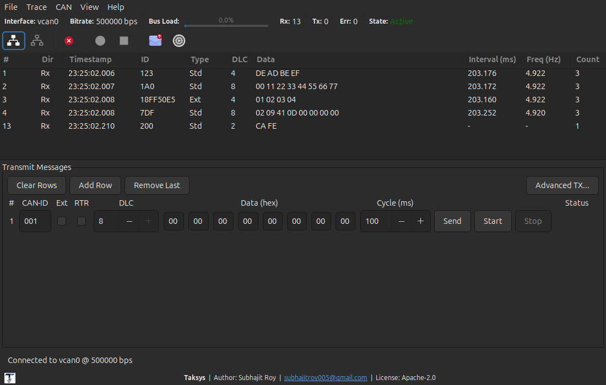
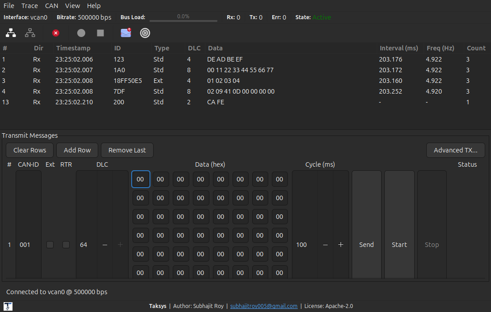
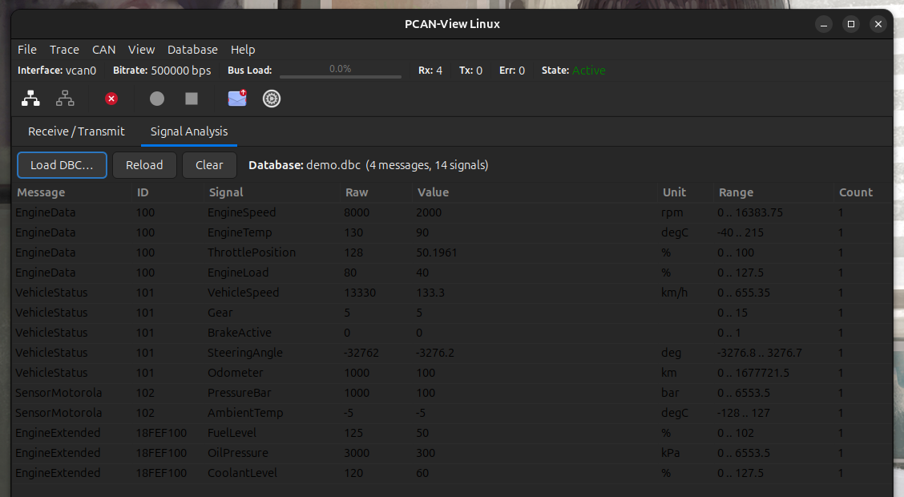
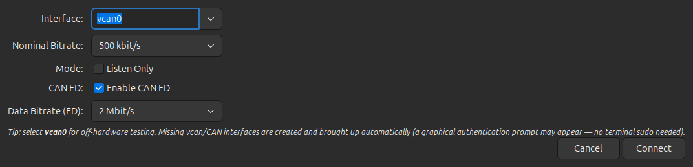
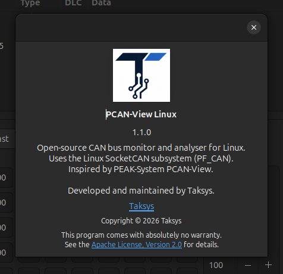

# PCAN-View Linux  ·  by Taksys

An open-source CAN bus monitor and analyser for Linux by **Taksys**, inspired by
[PEAK-System PCAN-View](https://www.peak-system.com/products/software/analysis-software/pcan-view/).
Uses the Linux **SocketCAN** subsystem (`PF_CAN / SOCK_RAW`) and provides a
**GTK 3** GUI with a live statistics bar, real-time message tracing, classic CAN
and CAN FD transmission, bus-load metering, and CSV trace export.

---

## Screenshots

**Main window** — live receive trace with roll-up counts, the statistics bar
below the menu, and the inline transmit panel:



**CAN FD transmit** — when CAN FD is enabled, a transmit row's DLC grows to 64
and the data-byte fields are added/removed dynamically, wrapping to fit:



**Signal Analysis** — individual signals decoded live from a DBC database
(physical values, units, ranges), CANalyzer-style:



<table>
<tr>
<td width="58%"><b>Connection settings</b><br>

</td>
<td width="42%"><b>About</b><br>

</td>
</tr>
</table>

---

## Features

| Feature | Detail |
|---|---|
| **CAN standards** | CAN 2.0 A (11-bit ID), CAN 2.0 B (29-bit ID), CAN FD |
| **Nominal bitrate** | 10 kbit/s … 1 Mbit/s |
| **CAN FD data bitrate** | 1 … 12 Mbit/s |
| **Statistics bar** | Always-visible bar below the menu (interface, bitrate, bus load, Rx/Tx/Err counts, bus state) |
| **Listen-only mode** | Passive monitoring without ACK generation |
| **Real-time trace** | Sequence #, direction, timestamp, ID, type, DLC, data |
| **Signal Analysis** | CANalyzer-style tab that decodes individual signals from a **DBC database** (Intel/Motorola byte order, factor/offset, signed) and updates raw + physical values live; bundled **demo database** auto-loads |
| **Signal Analysis Viewer** | Oscilloscope-style tab that plots any selection of decoded signals **over time** on a shared graph (per-signal colour, live legend values, adjustable time window, pause/reset); handles 1 kHz traffic with standard and extended IDs |
| **Message deduplication** | Unique-ID view that shows latest value + hit count |
| **Bus load** | Live bar updated every 500 ms |
| **Error frames** | Highlighted in red with CAN error flags decoded |
| **Message transmit** | One-shot and cyclic (configurable interval) |
| **CAN FD transmit** | Per-row DLC up to **64 bytes**; data-byte fields are added/removed dynamically with the DLC and wrap to fit the window |
| **Trace menu** | `Trace > Start / Stop / Save as CSV` — capture frames in memory, then export |
| **Trace CSV** | `seq, timestamp, direction, id, type, dlc, data` |
| **No-sudo vcan** | Missing vcan/CAN interfaces are created and brought up automatically via a graphical (pkexec) prompt — no terminal `sudo` |
| **Multithreading** | Separate threads for RX, TX, and statistics |
| **Virtual CAN** | Works with `vcan0` for off-hardware testing |
| **Desktop integration** | `make install` adds a launcher and Taksys icon to the application menu |

---

## Release Notes

### Unreleased

- **Signal Analysis tab** — a new Vector-CANalyzer-style page (alongside
  *Receive / Transmit*) that decodes individual signals from a loaded **DBC
  database**. Each signal shows its message, ID, raw value, scaled physical
  value, unit, and documented range, updating live as frames arrive. Supports
  Intel (little-endian) and Motorola (big-endian) bit layouts, `factor`/`offset`
  scaling, and signed signals — including extended-ID and CAN FD frames.
- **Signal Analysis Viewer tab** — an oscilloscope-style page (alongside
  *Signal Analysis*) that plots any selection of decoded signals **over time**
  on one shared graph. Each signal has its own colour and a live legend value;
  the time window is adjustable and the view can be paused and reset. Verified
  smooth at 1 kHz traffic with mixed standard and extended-ID frames over a
  sustained run with zero frame loss.
- **Database menu** — `Load DBC…`, `Load Demo DBC`, and `Clear Database`; the
  bundled **`demo.dbc`** auto-loads at startup so the tab is populated out of
  the box.

### v1.1.0 — Taksys customer release

- **Statistics bar** moved to a permanent, always-visible bar directly below the
  menu bar (interface, bitrate, bus load, Rx/Tx/Err counts, bus state).
- New **Trace** menu — `Start`, `Stop`, and `Save as CSV…`. Frames are captured
  in memory while recording and exported on demand; the capture is retained
  after disconnect so it can still be saved.
- **CAN FD transmit**: when CAN FD is enabled, a transmit row's DLC can grow to
  **64 bytes** and the data-byte fields are added/removed dynamically with the
  DLC, wrapping to stay inside the window.
- **Taksys branding** — logo and copyright in the About dialog, company logo and
  name in the footer, and an application/window icon.
- **One-command install** — `sudo make install` installs dependencies, compiles,
  and registers the app (binary, icon, and `.desktop` launcher) on the system.
- Bug fixes carried forward: the connect dialog stays reachable after a
  connect/disconnect cycle, and closing the window while connected exits
  cleanly (no hang/crash).

---

## Project Structure

```
PCAN-View-Linux/
├── main.c                     Entry point (GTK application init)
├── Makefile
├── inc/
│   ├── can_message.h          CAN message / stats types
│   ├── drv_can.h              Generic driver abstraction (vtable)
│   ├── socketcan.h            SocketCAN back-end interface
│   ├── app_state.h            Global application state
│   ├── dbc.h                  CAN database (DBC) model / decoder API
│   └── gui.h                  GUI widget bundle + declarations
├── driver/
│   ├── drv_can.c              Generic driver wrapper
│   ├── socketcan.c            SocketCAN implementation (PF_CAN)
│   └── dbc.c                  DBC parser + signal-bit decoder
├── gui/
│   ├── threads.c              RX / TX / stats threads + connect logic
│   ├── main_window.c          Main GTK window (menu, toolbar, notebook)
│   ├── message_view.c         Trace GtkTreeView + statistics panel
│   ├── signal_view.c          Signal Analysis tab (live DBC decode)
│   ├── signal_plot.c          Signal Analysis Viewer tab (signals over time)
│   ├── settings_dialog.c      Connection settings dialog
│   └── transmit_dialog.c      Message transmit window
├── assets/
│   ├── taksys_logo.png        Taksys brand logo (about dialog + footer)
│   ├── pcan-view.png          256×256 application icon
│   ├── demo.dbc              Bundled demo CAN database (Signal Analysis)
│   └── pcan-view.desktop      Desktop launcher entry
├── debian/                    Debian/Ubuntu packaging (control, rules, …)
├── .github/workflows/         CI/CD: build/test, docs, .deb + PPA release
├── Doxyfile                   Doxygen configuration (output → ./docs)
└── scripts/
    ├── install_dependencies.sh  Dependency installer (Debian/Ubuntu/Arch/Fedora)
    └── test_without_pcan.py     Local vcan smoke-test helper
```

---

## Driver Architecture

```
Application (GUI layer)
        │
        ▼
  can_driver_t  ← generic vtable (drv_can.h / drv_can.c)
        │
        ▼
  socketcan_ctx_t  ← SocketCAN back-end (socketcan.c)
        │
        ▼
  Linux kernel PF_CAN socket
        │
        ▼
  CAN hardware via kernel driver
  (vcan / peak_usb / peak_pci / slcan / …)
```

Adding a new back-end (e.g. PCAN-Basic chardev API) only requires
implementing the `can_driver_t` function-pointer table and passing it
to `drv_can_init()`.

---

## Threading Model

```
 ┌─────────────┐   g_idle_add   ┌─────────────┐
 │  rx_thread  │ ─────────────► │ GTK main    │
 │  (PF_CAN    │                │ thread      │
 │   select)   │                │ (event loop)│
 └─────────────┘                │             │
                                │             │
 ┌─────────────┐  GAsyncQueue   │             │
 │  tx_thread  │ ◄────────────  │ send button │
 │  (blocking  │                │ / cyclic    │
 │   write)    │                │ g_timeout   │
 └─────────────┘                └─────────────┘
 ┌─────────────┐   g_idle_add
 │ stats_thread│ ─────────────► gui_update_stats()
 │  500 ms     │
 └─────────────┘
```

All GTK widget updates happen exclusively in the GTK main thread via
`gdk_threads_add_idle()`.

---

## Prerequisites

### Dependencies

| Package | Purpose |
|---|---|
| `gcc` / `make` | Build toolchain |
| `libgtk-3-dev` | GTK 3 UI framework |
| `libglib2.0-dev` | GLib (async queues, threading utilities) |
| `pkg-config` | Compile flags for GTK |
| `can-utils` | `cansend`, `candump` for testing (optional) |
| `linux-headers` | SocketCAN header files (`linux/can.h`) |

### Kernel modules

```bash
modprobe can
modprobe can_raw
modprobe vcan        # for virtual CAN testing
modprobe peak_usb    # for PEAK-System USB hardware
```

---

## Install (recommended)

A single command installs the build/runtime dependencies, compiles the
application, and installs it as a desktop app (launcher + Taksys icon in the
application menu):

```bash
sudo make install
```

This performs, in order:

1. **Dependencies** – `scripts/install_dependencies.sh` (auto-detects
   apt / dnf / pacman).
2. **Compile** – optimised release build.
3. **Install** – binary to `/usr/local/bin/pcan-view`, the Taksys logo to
   `/usr/local/share/pcan-view/`, an icon to the hicolor theme, and a
   `pcan-view.desktop` launcher to `/usr/local/share/applications/`.

After installation, launch **PCAN-View Linux** from your application menu or run
`pcan-view` from a terminal.

| Command | Action |
|---|---|
| `sudo make install` | Dependencies + compile + system install + desktop entry |
| `sudo make install-deps` | Only install build/runtime dependencies |
| `sudo make uninstall` | Remove the installed application |
| `make` | Build into `./build/pcan-view` without installing |

Override the install location with `PREFIX=` / `DESTDIR=`, e.g.
`sudo make install PREFIX=/usr`.

### Install from a `.deb` package

A Debian/Ubuntu package can be built from the bundled `debian/` packaging and
installed with `apt` (which resolves the GTK runtime dependencies):

```bash
sudo apt-get install -y devscripts debhelper build-essential pkgconf \
    libgtk-3-dev libglib2.0-dev
dpkg-buildpackage -us -uc -b          # produces ../pcan-view_<version>_<arch>.deb
sudo apt-get install -y ../pcan-view_*.deb
```

Remove it again with `sudo apt-get purge -y pcan-view`.

### Install from the Ubuntu PPA

Released versions are published to a Launchpad PPA. Once the PPA is added, the
package installs and updates like any other:

```bash
sudo add-apt-repository ppa:subhajitroy/pcan-view
sudo apt-get update
sudo apt-get install -y pcan-view
```

> The CI pipeline (`.github/workflows/ppa.yml`) builds the signed source package
> per Ubuntu series and uploads it to the PPA on each version tag.

---

## Build & Run (from source)

### 1. Install dependencies

```bash
sudo ./scripts/install_dependencies.sh
```

### 2. Build

```bash
make              # optimised release
make DEBUG=1      # debug build with -g -O0
```

### 3. Run

```bash
# With a virtual CAN interface (no hardware needed).
# The app can create/bring up vcan0 itself (graphical auth prompt), or set it up
# manually:
sudo modprobe vcan
sudo ip link add dev vcan0 type vcan
sudo ip link set up vcan0

./build/pcan-view
# → File > Connect (or F5) → select vcan0, 500 kbit/s → Connect
```

### 4. Send a test frame (another terminal)

```bash
cansend vcan0 123#DEADBEEF
cansend vcan0 18FF50E5#0102030405060708    # extended frame
```

### 5. Virtual CAN test workflow

For a complete no-hardware test flow, see the **Virtual CAN Testing** section below.

### 6. Run with real PEAK hardware

PEAK-System USB/PCIe interfaces are supported out-of-the-box via the
`peak_usb` / `peak_pci` kernel module (Linux ≥ 3.2).

```bash
# Check available CAN interfaces
ip link show type can

# Connect using e.g. can0 at 500 kbit/s
sudo ./build/pcan-view
# → File > Connect → interface: can0, bitrate: 500 kbit/s → Connect
```

The application will automatically run `ip link set <iface> type can
bitrate <rate>` and `ip link set <iface> up`, so **root privileges (or
`CAP_NET_ADMIN`)** are required for real hardware.

---

## Virtual CAN Testing

Use this workflow to test the application without PEAK/PCAN hardware. It uses
Linux SocketCAN with a virtual CAN interface named `vcan0`.

### 1. Install prerequisites

Recommended:

```bash
sudo ./scripts/install_dependencies.sh
```

Manual Debian/Ubuntu install:

```bash
sudo apt update
sudo apt install -y build-essential pkg-config libgtk-3-dev can-utils iproute2 python3
```

Prepare the virtual CAN kernel module manually if you do not use the helper
script:

```bash
sudo modprobe vcan
sudo ip link add dev vcan0 type vcan
sudo ip link set dev vcan0 up
```

Check that the interface is available:

```bash
ip -details link show dev vcan0
```

### 2. Run test scripts

Build the app, create/bring up `vcan0` when needed, and verify SocketCAN
loopback:

```bash
python3 scripts/test_without_pcan.py
```

If the app is already built:

```bash
python3 scripts/test_without_pcan.py --skip-build
```

If `vcan0` already exists and is up, skip interface setup:

```bash
python3 scripts/test_without_pcan.py --skip-build --no-setup
```

Generate demo traffic for the GUI after connecting the app to `vcan0`:

```bash
python3 scripts/test_without_pcan.py --skip-build --no-setup --traffic-seconds 30
```

Launch the GTK application after the smoke test:

```bash
python3 scripts/test_without_pcan.py --skip-build --no-setup --launch-app
```

You can also send individual frames from another terminal:

```bash
cansend vcan0 123#DEADBEEF
cansend vcan0 18FF50E5#0102030405060708
```

---

## PCAN-View Feature Comparison

| PCAN-View (Windows) | This application |
|---|---|
| CAN 2.0 A/B trace | ✅ |
| CAN FD trace | ✅ |
| Timestamp (100 µs resolution) | ✅ (nanosecond via `CLOCK_REALTIME`) |
| Listen-only mode | ✅ |
| Bus load measurement | ✅ |
| Error frame display | ✅ |
| Message transmit (one-shot) | ✅ |
| Cyclic transmit | ✅ |
| Trace recording | ✅ (CSV) |
| Unique-message (dedup) view | ✅ |
| Filter by ID/mask | ✅ (driver level via `CAN_RAW_FILTER`) |
| Bus-off / warning states | ✅ |

---

## Extending the Driver

```c
/* Implement the can_driver_t interface */
static can_driver_t my_driver = {
    .init         = my_init,
    .deinit       = my_deinit,
    .send         = my_send,
    .recv         = my_recv,
    .get_stats    = my_get_stats,
    .set_filter   = my_set_filter,
    .clear_filter = my_clear_filter,
    .reset        = my_reset,
    .error_string = my_error_string,
};

/* Use it */
drv_can_init(&my_driver, "can0", 500000, 0, 0, 0);
```

---

## API Documentation

The codebase carries full Doxygen documentation (file, type, and function level).
Generate the HTML reference locally:

```bash
sudo apt-get install -y doxygen graphviz
make docs            # or: doxygen Doxyfile
xdg-open docs/index.html
```

The output is written to `./docs/index.html`. The CI pipeline
(`.github/workflows/docs.yml`) also builds the documentation and publishes it to
GitHub Pages on every push to `main`.

A man page is installed with the package and is also available in the source
tree at `debian/pcan-view.1`:

```bash
man pcan-view
```

---

## Continuous Integration

| Workflow | Purpose |
|---|---|
| `.github/workflows/ci.yml` | Build, `--version` smoke, headless GUI smoke (xvfb), Doxygen build, `.deb` build, `lintian`, and an install/removal test. |
| `.github/workflows/docs.yml` | Build the Doxygen docs and deploy to GitHub Pages. |
| `.github/workflows/ppa.yml` | On a `vX.Y.Z` tag: build the `.deb` for the GitHub Release and upload the signed source package to the Ubuntu PPA. |

---

## License

Apache License 2.0 – see [LICENSE](LICENSE).

---

## References

- [PEAK-System Linux driver documentation](https://www.peak-system.com/fileadmin/media/linux/index.php)
- [Linux SocketCAN documentation](https://www.kernel.org/doc/Documentation/networking/can.rst)
- [PCAN-View product page](https://www.peak-system.com/products/software/analysis-software/pcan-view/)
- [can-utils](https://github.com/linux-can/can-utils)
